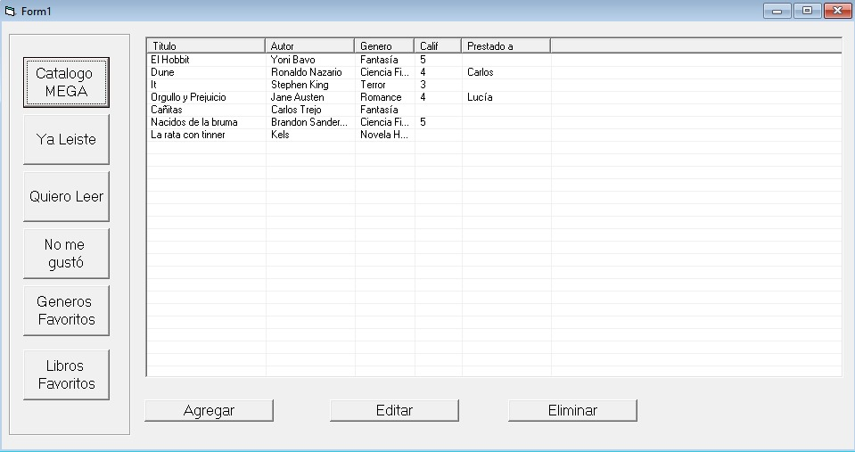
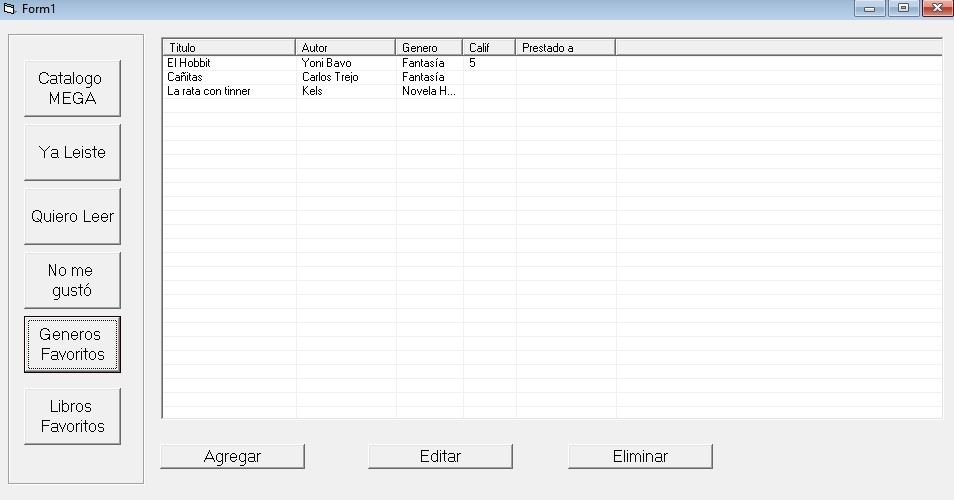
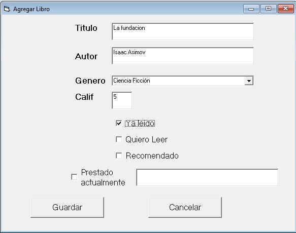
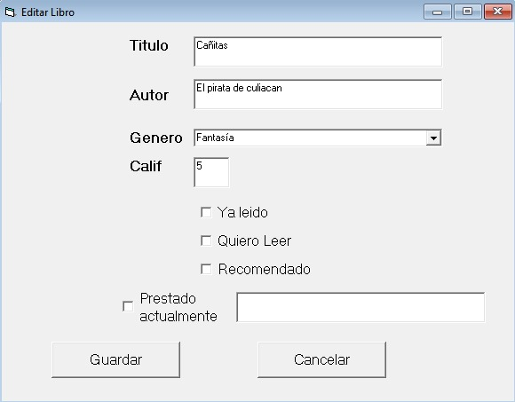
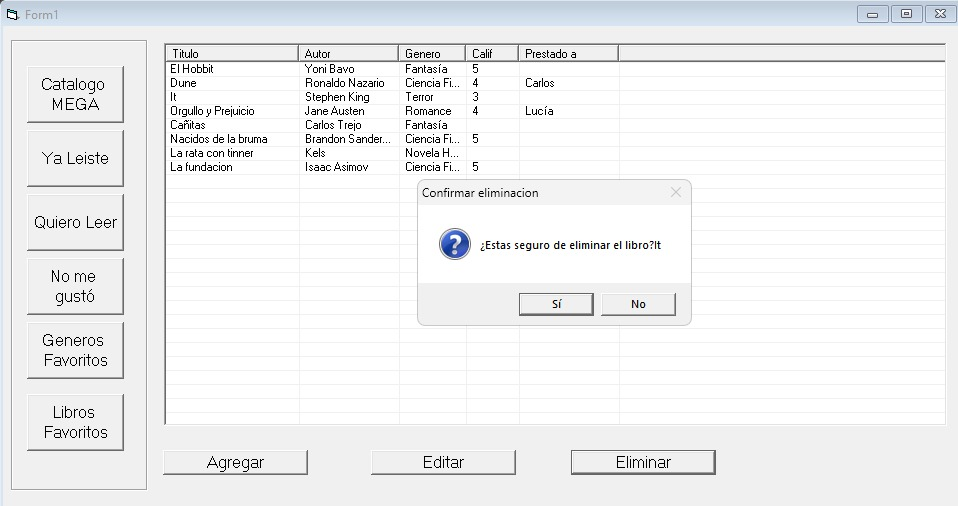
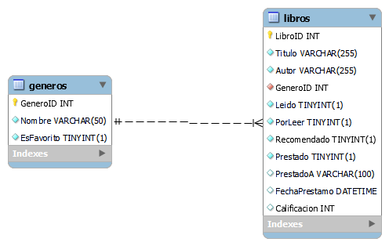

# 📚 MegaLibrería - Sprint 7 (VB6 + SQL Server)

**MegaLibrería**, una aplicación de escritorio hecha con Visual Basic 6 que gestiona un catálogo de libros personalizado. Este proyecto forma parte del **Sprint 7 **, enfocado en crear una interfaz gráfica funcional y conectar con una base de datos SQL Server.

---

## 👤 Autor

**Oscar Ramos**  

---

## 🖼️ Capturas de pantalla

> A continuación se muestran imágenes del proyecto corriendo localmente:

### 📖 Catálogo general

### ✔️ Libros favoritos

### ⭐ Agregar libros

### 📊 Formulario de editar libro

### 🗑️ Eliminación de libros

---

## ⚙️ ¿Cómo se hizo?

- Lenguaje: **Visual Basic 6**
- Base de Datos: **SQL Server** (local)
- Librería de conexión: **ADO con `ADODB.Connection`**
- Funciones CRUD completas: crear, leer, actualizar y eliminar libros
- Interfaz de usuario con botones funcionales y formularios modales (`vbModal`)
- Uso de `ListView` para desplegar la información en formato de tabla

---

## 🧩 Diagrama entidad-relación

> Agrega aquí tu imagen o diagrama de la base de datos, por ejemplo:

Tablas principales:
- `Libros` (ID, Título, Autor, GéneroID, Calificación, Prestado, etc.)
- `Generos` (ID, Nombre, EsFavorito)

Relación:  
`Libros.GeneroID` → `Generos.GeneroID` (1:N)

---

## 🐛 Problemas conocidos

- El sistema de calificación solo acepta valores del 1 al 5 de forma manual
- El campo "Prestado a" no valida existencia del contacto
- No hay control de sesión por usuario (solo se simulan preferencias)

---

## 🔍 Retrospectiva

### ✅ ¿Qué hice bien?

- Conecté exitosamente VB6 con SQL Server
- Hice toda la lógica de CRUD desde cero
- Implementé formularios dinámicos reutilizando el mismo Form para agregar y editar
- Mejoré la presentación con ListView y columnas ordenadas

### ⚠️ ¿Qué no salió bien?

- Algunos controles como checkboxes no eran intuitivos al principio
- Me costó ajustar los tamaños de columna en `ListView`
- Me tomó tiempo entender cómo guardar estados como “leído”, “favorito”, etc.

### 💡 ¿Qué puedo hacer diferente?

- Modularizar mejor la lógica (por ejemplo, mover SQL a funciones dedicadas)
- Usar constantes o enums para manejar estados en vez de números mágicos
- Incluir validaciones más robustas en los formularios

---

## 🧠 Tecnologías utilizadas

- Visual Basic 6 (IDE clásico)
- SQL Server
- ADO (ActiveX Data Objects)
- Diseño de formularios GUI
- Transact-SQL para operaciones CRUD

---

## ✅ Requisitos del Sprint

| Requisito                              | Estado |
|----------------------------------------|--------|
| Interfaz gráfica funcional en Windows  | ✅     |
| Guardado y edición con base de datos   | ✅     |
| Filtros por género, leídos, favoritos  | ✅     |
| Funcionalidad de eliminar registros    | ✅     |
| Preferencias de usuario (simuladas)    | ✅     |

---

## 📌 Notas

- Este proyecto es un prototipo funcional de escritorio para un sistema de biblioteca personal.
- Las pruebas se realizaron localmente en un entorno con SQL Server corriendo en la misma máquina.

